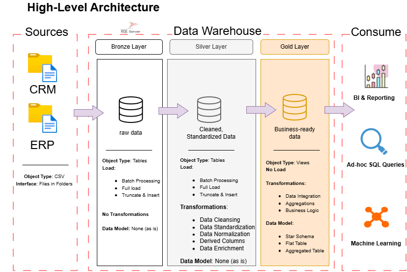

# Data Warehouse and Analytics

This repository implements a **Data Warehouse and Analytics** solution built on **SQL Server**, following a **Medallion Data Architecture** (Bronze, Silver, Gold).  
The project ingests raw data from **CRM** and **ERP** source systems, applies structured transformations, and loads curated datasets optimized for analytics and reporting.



---

## Overview

The goal of this project is to design and implement an end-to-end data platform that:

- Ingests raw operational data from heterogeneous sources (CRM, ERP)
- Applies consistent cleansing, normalization, and business transformations
- Organizes data using a **Medallion Architecture**
- Produces analytics-ready datasets for downstream consumption

The system is designed with **separation of concerns**, **traceability**, and **scalability** in mind.

---

## Architecture

### Medallion Data Architecture

The warehouse is organized into three logical layers:

#### 🥉 Bronze Layer (Raw)
- Stores ingested data in its original structure
- Minimal to no transformations
- Serves as a historical and auditable source of truth
- Handles schema drift and raw ingestion from files

#### 🥈 Silver Layer (Refined)
- Cleaned and standardized data
- Type casting, deduplication, and normalization
- Business keys resolved
- Data quality rules applied

#### 🥇 Gold Layer (Analytics)
- Business-ready, analytics-optimized datasets
- Aggregations, dimensional models, and fact tables
- Designed for BI tools and reporting use cases

---

## Data Sources

- **CRM System**
  - Customer data
  - Sales interactions
  - Accounts and contacts

- **ERP System**
  - Orders and transactions
  - Products and inventory
  - Financial and operational records

Data is ingested from **file-based extracts** provided by these systems.

---

## Technology Stack

- **Database**: SQL Server
- **Data Processing**: SQL (T-SQL)
- **Storage**: Relational tables organized by medallion layer
- **Architecture Pattern**: Medallion (Bronze / Silver / Gold)

---

## Data Flow (High Level)

1. Source systems export data as files (CRM / ERP)
2. Files are ingested into **Bronze** tables
3. Bronze data is validated and transformed into **Silver**
4. Silver data is modeled into **Gold** analytics tables
5. Gold tables are consumed by reporting and analytics tools

---

## Repository Structure (High Level)

```
.
├── scripts/
│   ├──/Silver
│   ├──/Bronze
│   └──/Gold
├── datasets/
│   ├── erp/
│   └── crm/
├── docs/
│   └── diagrams/
├── tests/
└── README.md
```

> **Note**: Exact structure may evolve as the project grows.

---

## Data Quality and Governance

- Raw data preserved in Bronze for auditability
- Deterministic transformations between layers
- Clear lineage from source → analytics
- Separation of raw, refined, and business logic

---

## TODOs

- [x] Add **Data Pipeline Flow Diagram**  
  *(End-to-end ingestion → transformation → analytics)*

- [x] Add **High-Level Project Architecture Diagram**  
  *(Sources, layers, SQL Server components)*

- [ ] Document **Data Models** for Gold Layer  
  *(Facts, dimensions, grain, keys)*

- [ ] Add **Data Quality Checks Documentation**

- [ ] Link BI / Analytics consumption examples

---

## Project Management & Documentation

Task tracking, implementation notes, and design decisions are maintained in Notion:

🔗 **Notion Workspace (Tasks & Progress)**  

[Workspace Link](https://www.notion.so/Data-Warehouse-Project-2f80f82a458d80b8821eeecc9ddc5383)
---

## Possible Future Enhancements

- Batch loading strategies
- CI/CD for SQL deployments
- Metadata and lineage tracking
- Performance optimization and indexing strategies

---

## License

This project is published uner the MIT License. Its use, cloning, or extension is permitted.
